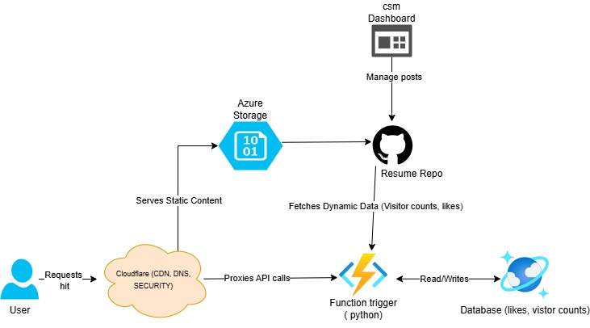

# Cloud Resume & Portfolio

A modern cloud-native resume and portfolio website showcasing DevOps and Cloud Engineering expertise.

**Live Site**: [samueladebodun.com](https://samueladebodun.com)



## Overview

This project demonstrates cloud architecture best practices through a fully automated, serverless portfolio website. Built with modern web technologies and deployed on Azure, it features real-time visitor tracking, automated CI/CD, and infrastructure as code.

## Tech Stack

**Frontend**
- Astro (Static Site Generation)
- Svelte (Interactive Components)
- Tailwind CSS (Styling)

**Backend**
- Azure Functions (Serverless API)
- Azure Cosmos DB (NoSQL Database)
- Python (Backend Logic)

**Infrastructure**
- Azure Static Web Apps (Hosting)
- Cloudflare (CDN, DNS, Security)
- Bicep (Infrastructure as Code)
- GitHub Actions (CI/CD)

## Key Features

- ✅ **Real-time Visitor Counter** - Azure Functions + Cosmos DB integration
- ✅ **Dark/Light Mode** - Responsive theme switching
- ✅ **Blog & Projects** - Markdown-based content management
- ✅ **Automated Deployment** - GitHub Actions CI/CD pipeline
- ✅ **Infrastructure as Code** - Bicep templates for Azure resources

## Quick Start

### Prerequisites
- Node.js 18+
- pnpm 9+

### Installation

```bash
# Clone repository
git clone https://github.com/yourusername/cloud-resume.git
cd cloud-resume

# Install dependencies
pnpm install

# Start development server
pnpm dev
```

Visit `http://localhost:4321`

## Configuration

### Environment Variables

Create a `.env` file:

```bash
PUBLIC_VISITOR_API_URL=https://your-function-app.azurewebsites.net/api/visitor_count
```

### Site Settings

Edit `src/config.ts` to customize:
- Site title and metadata
- Navigation links
- Social media links
- Theme colors

## Deployment

### Azure Infrastructure

Deploy Azure resources using Bicep:

```bash
# Install dependencies
pip install -r requirements.txt
ansible-galaxy collection install azure.azcollection

# Deploy infrastructure
./bin/deploy
```

### GitHub Actions

The project includes automated CI/CD:
1. Push to `main` branch
2. GitHub Actions builds the site
3. Deploys to Azure Static Web Apps
4. Cloudflare caches and serves content

## Project Structure

```
cloud-resume/
├── src/
│   ├── components/      # Reusable UI components
│   ├── content/         # Markdown content (posts, skills, experience)
│   ├── layouts/         # Page layouts
│   ├── pages/           # Route definitions
│   └── config.ts        # Site configuration
├── infra/               # Bicep templates
├── api/                 # Azure Functions
└── public/              # Static assets
```

## Architecture

```
User → Cloudflare (CDN) → Azure Static Web Apps (Frontend)
                              ↓
                        Azure Functions (API)
                              ↓
                        Cosmos DB (Database)
```

## License

[CC BY-NC-SA 4.0](https://creativecommons.org/licenses/by-nc-sa/4.0/)

---

**Author**: Samuel T. Adebodun  
**Role**: Cloud & DevOps Engineer  
**Contact**: [LinkedIn](https://linkedin.com/in/samuel-tomolaadebodun) | [GitHub](https://github.com/sagesta)
